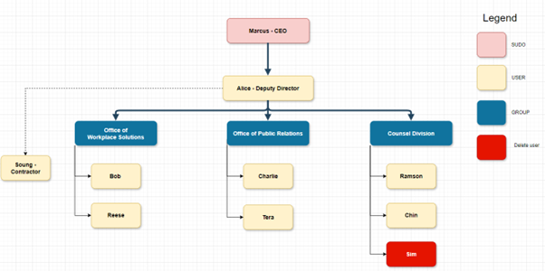

# Automating-Kali-User-Management
Managing users and groups manually can be time-consuming, especially when dealing with multiple users. In this project, we’ll automate the process using Bash scripts and TXT files. By the end of this guide, you’ll have a script that can create, update, and delete users and groups in bulk.

---

## 📋 Table of Contents
1. [Introduction](#Introduction)
2. [Prerequisites](#Prerequisites)
3. [Prepare the TXT file](#preparethetxtfile)
4. [Write the Bash Script](#writethebashscript)
5. [Run the Script](#runthescript)
6. [Common Issues and Troubleshooting](#commonissuesandtroubleshooting)
7. [Conclusion](#conlusion)
8. [Challenge (Optional)](#challenge)

---

<a name="Introduction"></a>
## 🎯 Introduction
In this project, we will create a Bash Script that reads user and group details from a TXT file and performs the following tasks:
- Create users.
- Set passwords.
- Create groups.
- Add users to groups.
- Updates user details.
- Deletes users and groups.

---

<a name="Prerequisites"></a>
## 🛠️ Prerequisites
- Kali Linux installed (or any Debian-based distribution).
- Basic knowledge of Bash scripting.
- Root or Sudo access.
- Basic understanding of Linux commands and Linux terminal.
- A text editor (e.g., Nano, Vim, VS Code)
  
---

<a name="preparethetxtfile"></a>
### 📜 Prepare the TXT file
The TXT file will store user and group details. Each line represents a user and groups. The format of the file will look like this:
```bash
action:username:password:group1, group2,....
```

- **action**: You can choose either "create", "update" or "delete".
- **username**: The user's full name.
- **password**: The user's password.
- **groups**: A comma seperated list of groups the user belongs to.

Example of TXT File:
```bash
create:marcus:password:CEO,sudo
create:alice:password:DeputyDirector
create:bob:password:OfficeOfWorkplaceSolutions
delete:sim
update:alice:NewPassword
```
Save this file as userList.

---

<a name="writethebashscript"></a>
### 🖥️ Write the Bash Script
Create a Bash script name create_update_delete_users.sh to automate user and group management. 

**Script**: create_update_delete_users.sh
```bash
#!/bin/bash

# Check if the script is run as root (superuser)
if [[ $(id -u) -ne 0 ]]; then
    echo "This script must be run as root!"
    exit 1
fi

# Input file format
# The file should contain lines in the format:
# action:username:password:group1,group2,...
# action can be "create", "delete", or "update"

INPUT_FILE="userList"

# Function to create user and set password
create_user() {
    local username=$1
    local password=$2
    local groups=$3

    # Create user with the specified username
    useradd -m "$username"

    # Set the password for the user
    echo "$username:$password" | chpasswd

    # Add user to groups
    for group in $(echo "$groups" | tr ',' ' '); do
        usermod -aG "$group" "$username"
    done

    echo "User $username created and added to groups: $groups"
}

# Function to delete a user
delete_user() {
    local username=$1

    # Delete the user (with their home directory and mail spool)
    userdel -r "$username"

    echo "User $username deleted"
}

# Function to update a user's password and/or groups
update_user() {
    local username=$1
    local password=$2
    local groups=$3

    # Update password for the user
    echo "$username:$password" | chpasswd

    # Update groups (if necessary)
    if [[ -n "$groups" ]]; then
        # First, remove user from all groups
        gpasswd -d "$username" $(groups "$username" | cut -d' ' -f2-)

        # Add user to new groups
        for group in $(echo "$groups" | tr ',' ' '); do
            usermod -aG "$group" "$username"
        done
    fi

    echo "User $username updated with new password and groups"
}

# Check if input file exists
if [[ ! -f $INPUT_FILE ]]; then
    echo "Input file $INPUT_FILE not found!"
    exit 1
fi

# Loop through each line in the input file
while IFS=':' read -r action username password groups; do
    # Skip empty lines and comments
    if [[ -z "$username" || "$username" =~ ^# ]]; then
        continue
    fi

    # Perform action based on the first field
    case "$action" in
        "create")
            create_user "$username" "$password" "$groups"
            ;;
        "delete")
            delete_user "$username"
            ;;
        "update")
            update_user "$username" "$password" "$groups"
            ;;
        *)
            echo "Unknown action: $action for user $username"
            ;;
    esac
done < "$INPUT_FILE"

echo "Operations completed."
```
---

<a name="runthescript"></a>
### 🤖 Run the Script
1. Make the script executable
```bash
chmod +x create_update_delete.sh
```
2. Run the script with sudo:
```bash
sudo ./create_update_delete.sh
```

---

<a name="commonissuesandtroubleshooting"></a>
### 🛠️ Common Issues and Troubleshooting
- Permission Denied ❌:

  Ensure you are running the script with sudo.

- TXT File Errors ⚠️:

  Check the TXT file for missing columns or incorrect formatting.

- Group Does Not Exist 🔍:

  Ensure all groups in the TXT file exist. If not, create them using groupadd.

- User Already Exists 🚫:

  Check if the user already exists before creating them.

---

<a name="conclusion"></a>
### 🎉 Conclusion
Congratulations! You’ve successfully automated user and group management in Kali Linux using a Bash script. This project demonstrates the power of automation in system administration and can be extended to handle more complex tasks.

---

<a name="challenge"></a>
### 🐧 Challenge (Optional)
In this challenge, you'll use the **Bash Script** and a TXT file to replicate the following Organization Chart in you Linux system. Good luck and have fun!

<p align="center">
  
  <br>
  <em>Img1: Organization Chart</em>
</p>

---

If you found this guide helpful, show some love by: 
- **Star** this repository ⭐️
- **Share** it with others
  

